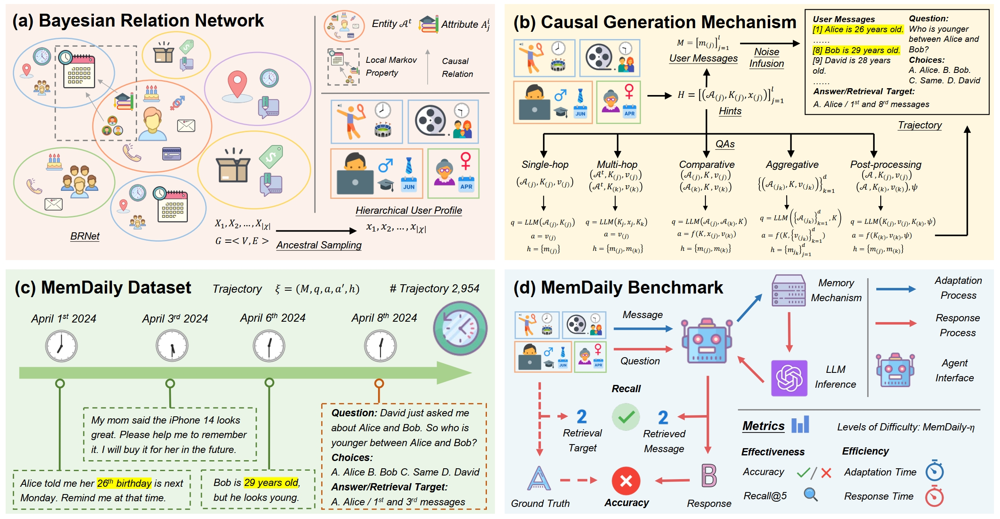

# MemSim: A Bayesian Simulator for Evaluating Memory of LLM-based Personal Assistants



LLM-based agents have been widely applied as personal assistants, capable of memorizing information from user messages and responding to personal queries. However, there still lacks an objective and automatic evaluation on their memory capability, largely due to the challenges in constructing reliable questions and answers (QAs) according to user messages. In this paper, we propose MemSim, a Bayesian simulator designed to automatically construct reliable QAs from generated user messages, simultaneously keeping their diversity and scalability. Specifically, we introduce the Bayesian Relation Network (BRNet) and a causal generation mechanism to mitigate the impact of LLM hallucinations on factual information, facilitating the automatic creation of an evaluation dataset. Based on MemSim, we generate a dataset in the daily-life scenario, named MemDaily, and conduct extensive experiments to assess the effectiveness of our approach. We also provide a benchmark for evaluating different memory mechanisms in LLM-based agents with the MemDaily dataset. To benefit the research community, we have released our project at https://github.com/nuster1128/MemSim.

## MemDaily Dataset

### Pre-generated Dataset MemDaily

We provide a copy of MemDaily Dataset that we have generated, and the summarization is shown as follows.

| Question  Types | Simp. | Cond. | Comp. | Aggr. | Post. | Noisy | Total  |
| :-------------: | :---: | :---: | :---: | :---: | :---: | :---: | :----: |
|  Trajectories   |  500  |  500  |  492  |  462  |  500  |  500  | 2,954  |
|    Messages     | 4215  | 4195  | 3144  | 5536  | 4438  | 4475  | 26,003 |
|    Questions    |  500  |  500  |  492  |  462  |  500  |  500  | 2,954  |
|       TPM       | 15.48 | 15.49 | 14.66 | 14.65 | 17.07 | 16.14 | 15.59  |

You can find it at  `data_generation/final_dataset/memdaily.json`.

### Run MemSim to Generate a New MemDaily Dataset

#### Step 1: Configure LLM backbone.

Configure your API Key in `data_generation/common.py`.

```python
llm = create_LLM({
    'model_name': 'GLM-4-0520',
    'model_type': 'remote',
    'api_key': 'XXX-API-KEY'
})
```

You may obtain a key from https://www.zhipuai.cn/.

#### Step 2: Generate user profiles.

Execute the following commands. 

```shell
cd data_generation
python generate_user_profiles.py
```

Then, you will obtain user profiles in `graph.json`.

#### Step 3: Generate user messages and construct QAs.

Choose one file of any types of generation in `data_generation`, and execute the following commands. 

```shell
python GENERATION_TYPE.py
```

The generation types are shown as follows:

- 01: Simple QAs.
- 02: Conditional QAs.
- 03: Comparative QAs.
- 04: Aggregative QAs.
- 05: Post-processing QAs.
- 06: Noisy QAs.

The entities are shown as follows:

- generate_memory_and_questions: related individuals and events.
- additional_generation: items and places.
- combination generations: combine all the entities above.

### Step 4: Formulate MemDaily

First of all, copy all the generated sub-data into `data_generation/final_dataset/messages_and_QAs` to replace the original ones. Then, execute the following commands. 

```shell
python post_process.py
```

Finally, you could find a new MemDaily Dataset  `data_generation/final_dataset/memdaily.json`.

## MemDaily Benchmark

### Full Results of Benchmark

The full benchmark can be found in `benchmark/full_results`.

### Run the Benchmark to Evaluate Memory Mechanisms

#### * Step 1: Prepare Datasets

You can prepare datasets by your self, or use our prepared datasets from https://drive.google.com/drive/folders/1cO8aVCOLrRZflQs4gz8PwiH9SnOTOKJq?usp=sharing and put it into `benchmark/data`.

If you want to re-generate the dataset, you can execute the following commands:

```shell
cd benchmark/rawdata
python infuse_noise.py
```

You can also replace `MemDaily.json` to your versions.

#### Step 2: Configuration

You can configure your experimental settings in the files of `configs` dictionary.

The configuration mainly includes: question types, datasets, baselines, LLM backbones, metrics, paths.

#### * Step 3: Run LLM Backbone

Our agents require LLM to conduct the inference process. If you want to run a local model (such as GLM-4-9B), you can edit `local_glm4_local.py` and execute as follows.

```shell
cd benchmark
nohup python -u local_glm4_run.py 0 > glm4_local.log 2>&1 &
```

You can also prepare an API-based LLM, which could refers to `benchmark/utils.py`.

#### Step 4: Run Benchmark

You can run the benchmark by the following commands.

```shell
python main.py
```

## Acknowledgement

Please cite our paper if it can help you.

## Contact us

If you have any questions or suggestions, please feel free to contact us via:

Email: [zeyuzhang@ruc.edu.cn](mailto:zeyuzhang@ruc.edu.cn)
